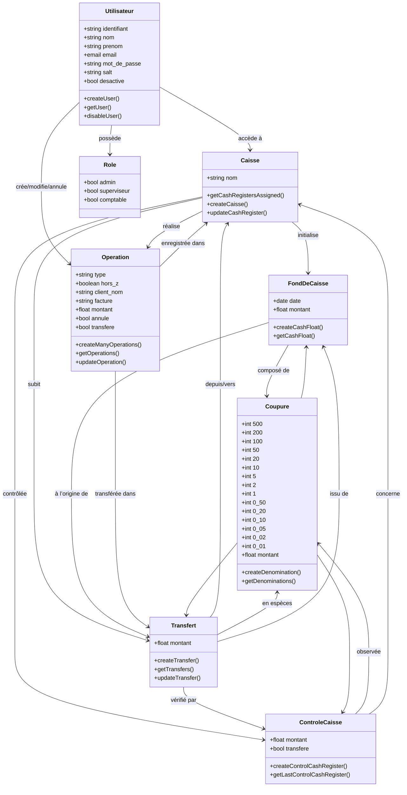

```mermaid
classDiagram
class Caisse {
	+string nom
	+getCashRegistersAssigned()
    +createCaisse()
    +updateCashRegister()
}

class Role {
	+bool admin
	+bool superviseur
	+bool comptable
}

class Utilisateur {
	+string identifiant
	+string nom
	+string prenom
	+email email
	+string mot_de_passe
	+string salt
	+bool desactive
	+createUser()
    +getUser()
    +disableUser()
} 

class Coupure {
	+int 500
	+int 200
	+int 100
	+int 50
	+int 20
	+int 10
	+int 5
	+int 2
	+int 1
	+int 0_50
	+int 0_20
	+int 0_10
	+int 0_05
	+int 0_02
	+int 0_01
	+float montant
	+createDenomination()
    +getDenominations()
}

class FondDeCaisse {
	+date date
	+float montant
	+createCashFloat()
    +getCashFloat()
}

class Operation {
	+string type
	+boolean hors_z
	+string client_nom
	+string facture
	+float montant
	+bool annule
	+bool transfere
	+createManyOperations()
    +getOperations()
    +updateOperation()
}

class Transfert {
	+float montant
	+createTransfer()
    +getTransfers()
    +updateTransfer()
}

class ControleCaisse {
	+float montant
	+bool transfere
	+createControlCashRegister()
    +getLastControlCashRegister()
}

%% === Relations ===

Utilisateur --> Role : possède
Utilisateur --> Caisse : accède à
Utilisateur --> Operation : crée/modifie/annule

Caisse --> FondDeCaisse : initialise
Caisse --> Operation : réalise
Caisse --> Transfert : subit
Caisse --> ControleCaisse : contrôlée

FondDeCaisse --> Coupure : composé de
FondDeCaisse --> Transfert : à l’origine de

Operation --> Transfert : transférée dans
Operation --> Caisse : enregistrée dans

Transfert --> Caisse : depuis/vers
Transfert --> Coupure : en espèces
Transfert --> FondDeCaisse : issu de
Transfert --> ControleCaisse : vérifié par

ControleCaisse --> Coupure : observée
ControleCaisse --> Caisse : concerne

Coupure --> FondDeCaisse
Coupure --> ControleCaisse
Coupure --> Transfert
```
