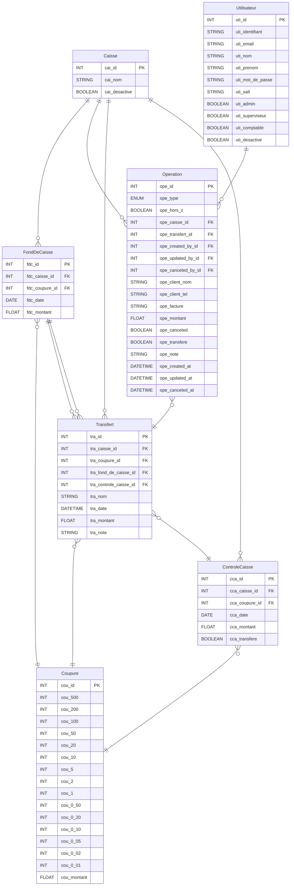

```mermaid
erDiagram
  Caisse ||--o{ FondDeCaisse : ""
  Caisse ||--o{ Operation : ""
  Caisse ||--o{ Transfert : ""
  Caisse ||--o{ ControleCaisse : ""

  Utilisateur ||--o{ Operation : ""

  FondDeCaisse }o--|| Coupure : ""
  FondDeCaisse ||--o{ Transfert : ""

  Operation }o--|| Transfert : ""

  Transfert }o--|| Coupure : ""
  Transfert }o--|| FondDeCaisse : ""
  Transfert }o--|| ControleCaisse : ""

  ControleCaisse }o--|| Coupure : ""

  Caisse {
    INT cai_id PK
    STRING cai_nom
    BOOLEAN cai_desactive
  }

  Utilisateur {
    INT uti_id PK
    STRING uti_identifiant
    STRING uti_email
    STRING uti_nom
    STRING uti_prenom
    STRING uti_mot_de_passe
    STRING uti_salt
    BOOLEAN uti_admin
    BOOLEAN uti_superviseur
    BOOLEAN uti_comptable
    BOOLEAN uti_desactive
  }

  FondDeCaisse {
    INT fdc_id PK
    INT fdc_caisse_id FK
    INT fdc_coupure_id FK
    DATE fdc_date
    FLOAT fdc_montant
  }

  Coupure {
    INT cou_id PK
    INT cou_500
    INT cou_200
    INT cou_100
    INT cou_50
    INT cou_20
    INT cou_10
    INT cou_5
    INT cou_2
    INT cou_1
    INT cou_0_50
    INT cou_0_20
    INT cou_0_10
    INT cou_0_05
    INT cou_0_02
    INT cou_0_01
    FLOAT cou_montant
  }

  Operation {
    INT ope_id PK
    ENUM ope_type
    BOOLEAN ope_hors_z
    INT ope_caisse_id FK
    INT ope_transfert_id FK
    INT ope_created_by_id FK
    INT ope_updated_by_id FK
    INT ope_canceled_by_id FK
    STRING ope_client_nom
    STRING ope_client_tel
    STRING ope_facture
    FLOAT ope_montant
    BOOLEAN ope_canceled
    BOOLEAN ope_transfere
    STRING ope_note
    DATETIME ope_created_at
    DATETIME ope_updated_at
    DATETIME ope_canceled_at
  }

  Transfert {
    INT tra_id PK
    INT tra_caisse_id FK
    INT tra_coupure_id FK
    INT tra_fond_de_caisse_id FK
    INT tra_controle_caisse_id FK
    STRING tra_nom
    DATETIME tra_date
    FLOAT tra_montant
    STRING tra_note
  }

  ControleCaisse {
    INT cca_id PK
    INT cca_caisse_id FK
    INT cca_coupure_id FK
    DATE cca_date
    FLOAT cca_montant
    BOOLEAN cca_transfere
  }
```