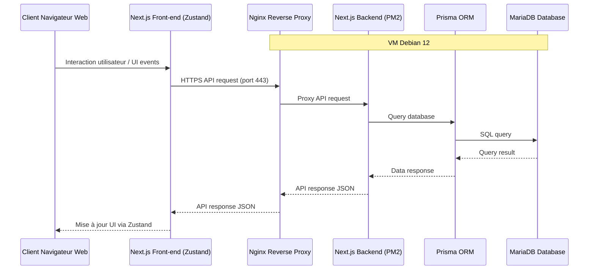

```mermaid
sequenceDiagram
    participant Browser as Client Navigateur Web
    participant Frontend as Next.js Front-end (Zustand)
    participant Nginx as Nginx Reverse Proxy
    participant Backend as Next.js Backend (PM2)
    participant Prisma as Prisma ORM
    participant MariaDB as MariaDB Database

    Note over Nginx, MariaDB: VM Debian 12

    Browser->>Frontend: Interaction utilisateur / UI events
    Frontend->>Nginx: HTTPS API request (port 443)
    Nginx->>Backend: Proxy API request
    Backend->>Prisma: Query database
    Prisma->>MariaDB: SQL query
    MariaDB-->>Prisma: Query result
    Prisma-->>Backend: Data response
    Backend-->>Nginx: API response JSON
    Nginx-->>Frontend: API response JSON
    Frontend-->>Browser: Mise à jour UI via Zustand
```

