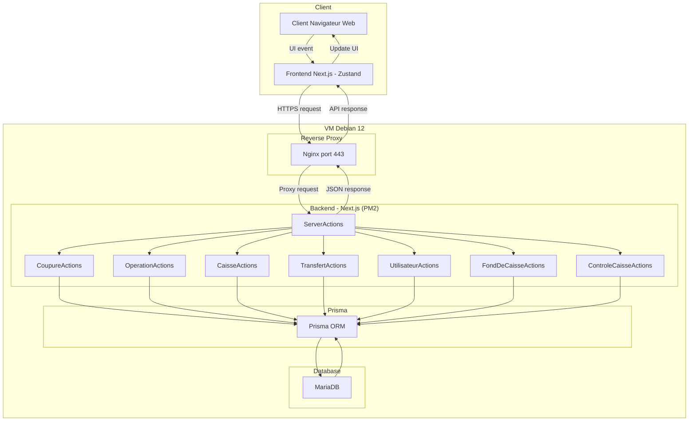

```mermaid
graph TD
    subgraph Client
        A1[Client Navigateur Web]
        A2[Frontend Next.js - Zustand]
        A1 -->|UI event| A2
    end

    subgraph "VM Debian 12"
        subgraph "Reverse Proxy"
            B1[Nginx port 443]
        end

        subgraph "Backend - Next.js (PM2)"
            B2[ServerActions]
            B2 --> C1[CoupureActions]
            B2 --> C2[OperationActions]
            B2 --> C3[CaisseActions]
            B2 --> C4[TransfertActions]
            B2 --> C5[UtilisateurActions]
            B2 --> C6[FondDeCaisseActions]
            B2 --> C7[ControleCaisseActions]
        end

        subgraph Prisma
            D1[Prisma ORM]
        end

        subgraph Database
            E1[MariaDB]
        end
    end

    A2 -->|HTTPS request| B1
    B1 -->|Proxy request| B2

    %% Actions vers Prisma
    C1 --> D1
    C2 --> D1
    C3 --> D1
    C4 --> D1
    C5 --> D1
    C6 --> D1
    C7 --> D1

    D1 --> E1
    E1 --> D1

    B2 -->|JSON response| B1
    B1 -->|API response| A2
    A2 -->|Update UI| A1

```