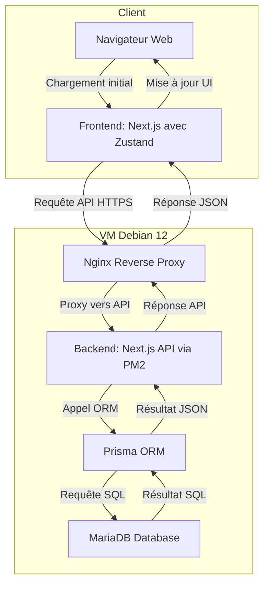
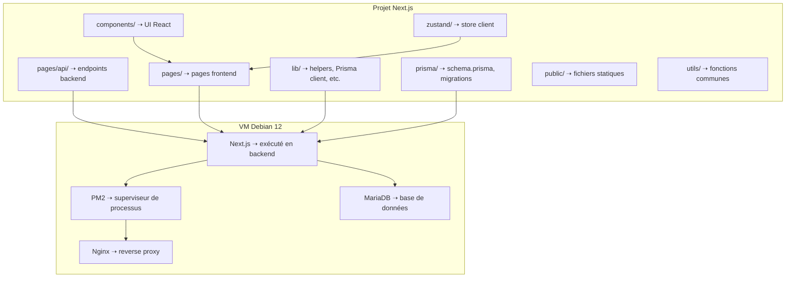

```mermaid
graph TD
    %% Clients
    subgraph Client
        direction TB
        A1[Navigateur Web]
        A2[Frontend: Next.js avec Zustand]
    end

    %% Serveur (VM)
    subgraph "VM Debian 12"
        direction TB
        B1[Nginx Reverse Proxy]
        B2[Backend: Next.js API via PM2]
        B3[Prisma ORM]
        B4[MariaDB Database]
    end

    A1 -->|Chargement initial| A2
    A2 -->|Requête API HTTPS| B1
    B1 -->|Proxy vers API| B2
    B2 -->|Appel ORM| B3
    B3 -->|Requête SQL| B4
    B4 -->|Résultat SQL| B3
    B3 -->|Résultat JSON| B2
    B2 -->|Réponse API| B1
    B1 -->|Réponse JSON| A2
    A2 -->|Mise à jour UI| A1
```

```mermaid
graph TD
    subgraph "Projet Next.js"
        direction TB
        A1[pages/api/ ➝ endpoints backend]
        A2[pages/ ➝ pages frontend]
        A3[components/ ➝ UI React]
        A4[lib/ ➝ helpers, Prisma client, etc.]
        A5[prisma/ ➝ schema.prisma, migrations]
        A6[public/ ➝ fichiers statiques]
        A7[zustand/ ➝ store client]
        A8[utils/ ➝ fonctions communes]
    end

    subgraph VM["VM Debian 12"]
        B1[Nginx ➝ reverse proxy]
        B2[PM2 ➝ superviseur de processus]
        B3[Next.js ➝ exécuté en backend]
        B4[MariaDB ➝ base de données]
    end

    A1 --> B3
    A2 --> B3
    A3 --> A2
    A4 --> B3
    A5 --> B3
    A7 --> A2
    B3 --> B2
    B2 --> B1
    B3 --> B4

```