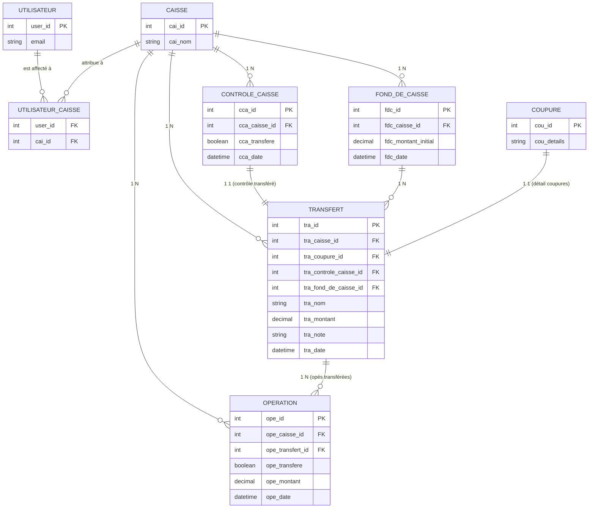

```mermaid
erDiagram
  UTILISATEUR ||--o{ UTILISATEUR_CAISSE : "est affecté à"
  CAISSE ||--o{ UTILISATEUR_CAISSE : "attribue à"
  CAISSE ||--o{ CONTROLE_CAISSE : "1 N"
  CAISSE ||--o{ FOND_DE_CAISSE : "1 N"
  CAISSE ||--o{ OPERATION : "1 N"
  CAISSE ||--o{ TRANSFERT : "1 N"

  CONTROLE_CAISSE ||--|| TRANSFERT : "1 1 (contrôle transféré)"
  FOND_DE_CAISSE ||--o{ TRANSFERT : "1 N"
  COUPURE ||--|| TRANSFERT : "1 1 (détail coupures)"
  TRANSFERT ||--o{ OPERATION : "1 N (opés transférées)"

  UTILISATEUR {
    int user_id PK
    string email
  }

  UTILISATEUR_CAISSE {
    int user_id FK
    int cai_id FK
  }

  CAISSE {
    int cai_id PK
    string cai_nom
  }

  CONTROLE_CAISSE {
    int cca_id PK
    int cca_caisse_id FK
    boolean cca_transfere
    datetime cca_date
  }

  FOND_DE_CAISSE {
    int fdc_id PK
    int fdc_caisse_id FK
    decimal fdc_montant_initial
    datetime fdc_date
  }

  COUPURE {
    int cou_id PK
    string cou_details
  }

  TRANSFERT {
    int tra_id PK
    int tra_caisse_id FK
    int tra_coupure_id FK
    int tra_controle_caisse_id FK
    int tra_fond_de_caisse_id FK
    string tra_nom
    decimal tra_montant
    string tra_note
    datetime tra_date
  }

  OPERATION {
    int ope_id PK
    int ope_caisse_id FK
    int ope_transfert_id FK
    boolean ope_transfere
    decimal ope_montant
    datetime ope_date
  }
```
