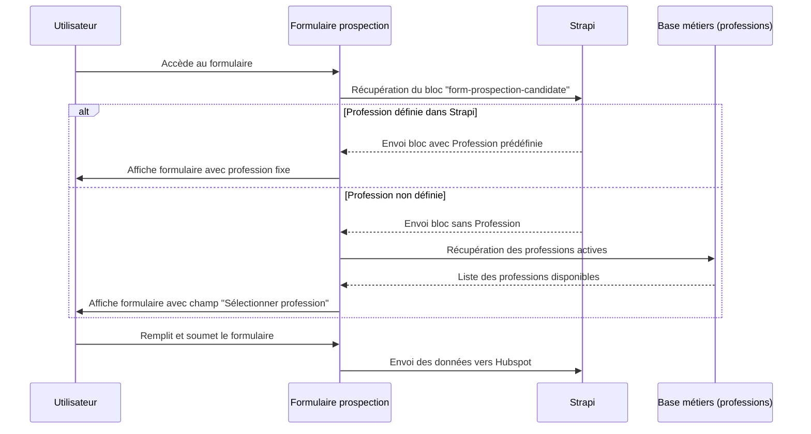

```mermaid
sequenceDiagram
    participant U as Utilisateur
    participant F as Formulaire prospection
    participant S as Strapi
    participant DB as Base métiers (professions)

    U->>F: Accède au formulaire
    F->>S: Récupération du bloc "form-prospection-candidate"
    alt Profession définie dans Strapi
        S-->>F: Envoi bloc avec Profession prédéfinie
        F->>U: Affiche formulaire avec profession fixe
    else Profession non définie
        S-->>F: Envoi bloc sans Profession
        F->>DB: Récupération des professions actives
        DB-->>F: Liste des professions disponibles
        F->>U: Affiche formulaire avec champ "Sélectionner profession"
    end
    U->>F: Remplit et soumet le formulaire
    F->>S: Envoi des données vers Hubspot
```
