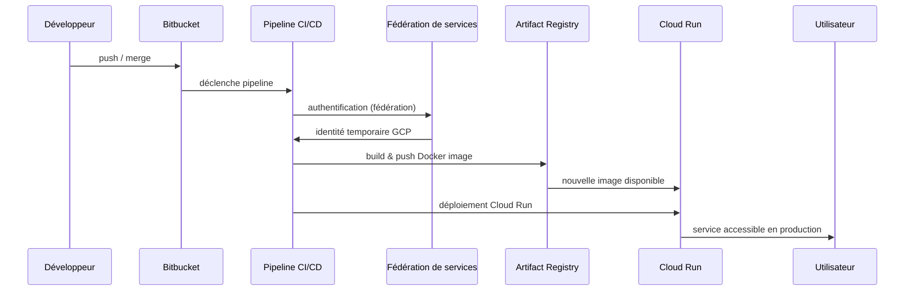

```mermaid
sequenceDiagram
    participant Dev as Développeur
    participant BB as Bitbucket
    participant CI as Pipeline CI/CD
    participant Fed as Fédération de services
    participant Reg as Artifact Registry
    participant CR as Cloud Run
    participant User as Utilisateur

    Dev->>BB: push / merge
    BB->>CI: déclenche pipeline
    CI->>Fed: authentification (fédération)
    Fed->>CI: identité temporaire GCP
    CI->>Reg: build & push Docker image
    Reg->>CR: nouvelle image disponible
    CI->>CR: déploiement Cloud Run
    CR->>User: service accessible en production
```
