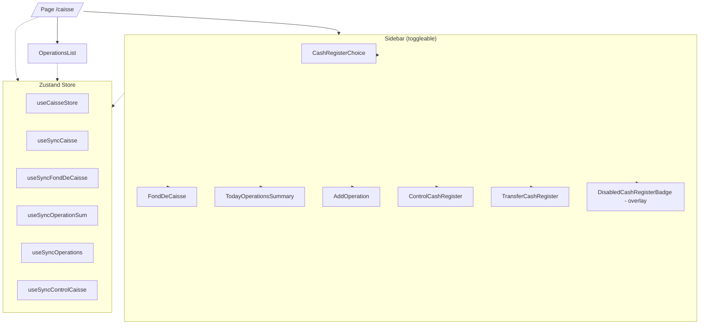

```mermaid
graph TD

  Page[/Page /caisse/]

  subgraph Sidebar["Sidebar (toggleable)"]
    CashRegisterChoice[CashRegisterChoice]
    FondDeCaisse[FondDeCaisse]
    TodayOperationsSummary[TodayOperationsSummary]
    AddOperation[AddOperation]
    ControlCashRegister[ControlCashRegister]
    TransferCashRegister[TransferCashRegister]
    DisabledCashRegisterBadge[DisabledCashRegisterBadge - overlay]
  end

  OperationsList[OperationsList]

  Page --> Sidebar
  Page --> OperationsList

  Sidebar --> CashRegisterChoice
  Sidebar --> FondDeCaisse
  Sidebar --> TodayOperationsSummary
  Sidebar --> AddOperation
  Sidebar --> ControlCashRegister
  Sidebar --> TransferCashRegister
  Sidebar --> DisabledCashRegisterBadge

  subgraph Store["Zustand Store"]
    useCaisseStore[useCaisseStore]
    useSyncCaisse[useSyncCaisse]
    useSyncFondDeCaisse[useSyncFondDeCaisse]
    useSyncOperationSum[useSyncOperationSum]
    useSyncOperations[useSyncOperations]
    useSyncControlCaisse[useSyncControlCaisse]
  end

  Page -.-> Store
  Sidebar -.-> Store
  OperationsList -.-> Store

```
