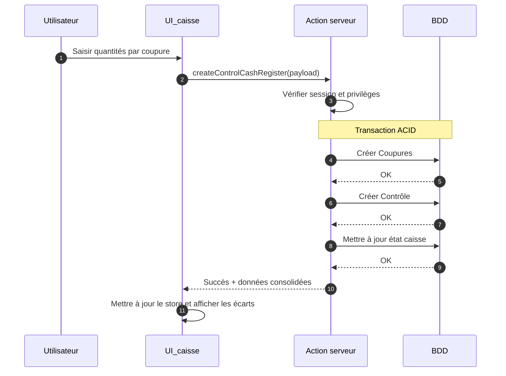

```mermaid
sequenceDiagram
  autonumber
  participant U as Utilisateur
  participant UI as UI_caisse
  participant SA as Action serveur
  participant DB as BDD

  U->>UI: Saisir quantités par coupure
  UI->>SA: createControlCashRegister(payload)
  SA->>SA: Vérifier session et privilèges
  Note over SA,DB: Transaction ACID
  SA->>DB: Créer Coupures
  DB-->>SA: OK
  SA->>DB: Créer Contrôle
  DB-->>SA: OK
  SA->>DB: Mettre à jour état caisse
  DB-->>SA: OK
  SA-->>UI: Succès + données consolidées
  UI->>UI: Mettre à jour le store et afficher les écarts
```
