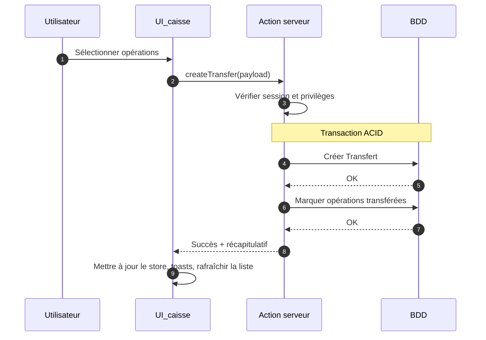

```mermaid
sequenceDiagram
  autonumber
  participant U as Utilisateur
  participant UI as UI_caisse
  participant SA as Action serveur
  participant DB as BDD

  U->>UI: Sélectionner opérations
  UI->>SA: createTransfer(payload)
  SA->>SA: Vérifier session et privilèges
  Note over SA,DB: Transaction ACID
  SA->>DB: Créer Transfert
  DB-->>SA: OK
  SA->>DB: Marquer opérations transférées
  DB-->>SA: OK
  SA-->>UI: Succès + récapitulatif
  UI->>UI: Mettre à jour le store, toasts, rafraîchir la liste
```
