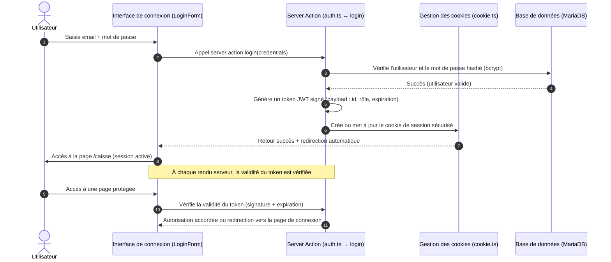

```mermaid
sequenceDiagram
    autonumber
    actor U as Utilisateur
    participant F as Interface de connexion (LoginForm)
    participant S as Server Action (auth.ts → login)
    participant C as Gestion des cookies (cookie.ts)
    participant DB as Base de données (MariaDB)
    
    U->>F: Saisie email + mot de passe
    F->>S: Appel server action login(credentials)
    S->>DB: Vérifie l'utilisateur et le mot de passe hashé (bcrypt)
    DB-->>S: Succès (utilisateur valide)
    S->>S: Génère un token JWT signé (payload : id, rôle, expiration)
    S->>C: Crée ou met à jour le cookie de session sécurisé
    C-->>F: Retour succès + redirection automatique
    F->>U: Accès à la page /caisse (session active)
    
    Note over F,S: À chaque rendu serveur, la validité du token est vérifiée
    U->>F: Accès à une page protégée
    F->>S: Vérifie la validité du token (signature + expiration)
    S-->>F: Autorisation accordée ou redirection vers la page de connexion
```
